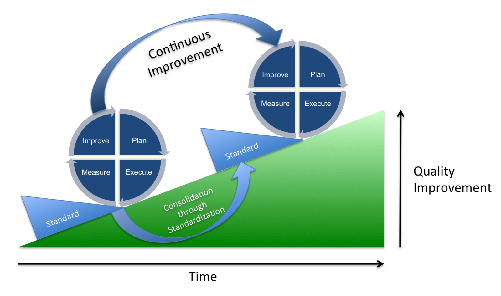

\newpage
CHAPTER 7: We’re Not Done Yet: Continuous Improvement
-----------------------------------------------------

How do you know if your Evidence-Based Hiring process is any good? There is only one way to tell—look at the data.

As in science, if you collect the data right, the data will be honest to you. Sometimes, the data will tell that you are doing well; sometimes, that you are doing badly; and, sometimes, that you’re not really doing anything at all. A good rule of thumb is that, if a company says that their screening procedure is excellent, it’s likely they’re not analyzing their data at all.

While there is good research on the general validity of each screening method, the best method to use is likely to vary slightly for your specific industry. You must systematically evaluate what methods and questions work for *your* profession and in *your* locale. Thus, your screening process becomes a never-ending cycle of Plan → Execute → Measure → Improve[^pdca], see the next figure.

[^pdca]: Also known as PDCA cycle: <https://en.wikipedia.org/wiki/PDCA>

{width=95%}

*Planning* is deciding what methods to use, what skills are necessary, and what questions to ask.

*Executing* is doing the screening rounds.

*Measuring* is writing down all candidate answers and scores.

*Improving* is analyzing what is good and what is bad in your process, and changing your hiring standards for the next round.

Note that *improving* part can even start in the *execution* phase, because, after reviewing just a few candidates, you will already have enough data to notice mistakes. 

Here are checklists of what to review during different parts of the screening process:

Résumé screening checklist         | When to check?        | Corrective action     |
:---                               | :---                  | :-------              |
Does screening of each résumé take too much time? | After 5-10 résumés | Create a list of selection criteria or shorten your existing one. |
Do applicants have the desired level of experience? | After 10-20 résumés screened | If you want more experienced applicants, update the Job Ad to target them: \
- Raise salary level.\
- Explicitly state that you’re looking for experience.\
- Update company branding to reflect employee age diversity. |
Are too many applicants applying? | After 50-100 applications | Revise the Job Ad to include more requirements, and make sure that the application form has questions that eliminate candidates. |

Preparing questions checklist      | When to check?        | Corrective action     |
:------                            | :------               | :-------              |
Are the questions ambiguous? | Immediately after writing questions | Send questions to, at least, one other coworker for review. |
Are the answers to the questions available online? | Immediately after writing questions | Rephrase question using suggestions from [*Chapter 5: Level 2: Understanding*](#level-2-understanding) to make it less googleable. |

Testing candidates checklist       | When to check?        | Corrective action     |
:---                               | :---                  | :-------              |
Do the majority of candidates answer the question correctly? | After 5-10 candidates tested | If everybody answers the question correctly, it has no predictive value. Make it harder, or replace with another question. |
Do all of the candidates answer the question incorrectly? | After 10-30 candidates tested | Since you’re searching for a top-10% candidate, most applicants should get your questions wrong. But, if 100% fail, it’s likely the question, not them. Make it easier, or replace with another question. |
Do enough people answer the question within the allotted time? | After 10-30 candidates tested | Fast solvers often need only half the allotted time. If most of the correct answers as submitted close to the maximum time, increase that maximum. |
Do many, otherwise good, applicants give the same, incorrect answer? | After 10-30 candidates tested | There is a high probability that they are right and you are wrong. Double-check the correct answer. |

Structured Interview checklist     | When to check?        | Corrective action     |
:---                               | :---                  | :-------              |
Do interviews overrun their allotted time? | After 2-3 candidates interviewed | Ask a more experienced interviewer to sit in and give feedback. An interviewer should talk less than 30% of the time, whilst still controlling the flow of the conversation. |
Do candidates have a wrong impression of the job? | After 3-5 candidates interviewed | The Job Ad is probably misrepresenting the job. Ensure that every key task, responsibility, perk, and expectation is listed there. |

Negotiation checklist              | When to check?        | Corrective action     |
:---                               | :---                  | :-------              |
Do negotiations with potential hires often fail? | After 2-3 failed negotiations | Be more transparent with candidates in the entire process after every step, from the Job Ad to the negotiation. |
Do you regularly lose promising applicants to other companies during the screening process? | After 2-3 lost candidates | Audit your process against similar companies. How long are they taking to make an offer? Increase the speed of your screening process. |

Post-hire checklist              | When to check?        | Corrective action     |
:---                             | :---                  | :-------              |
Does a new hire fail to perform on the job? | After 2-6 months of employment | Check if the job requires a different set of skills than what is tested in the screening process. |
High turnaround of new hires? | After 6-18 months of employment | Get feedback from people leaving the company. Use that knowledge to improve motivation questions asked at interview. \
\
If the problem persists, there might be an issue with your company culture. Undertake an anonymous employee survey. |

Some of these problems, such as question difficulty and allotted time, are really hard to get right when creating your initial hiring process. Accept this and adopt a lean approach, correcting mistakes as soon as you have the necessary data. You don’t need anything high-tech—spreadsheet software and a list of reminders is enough.